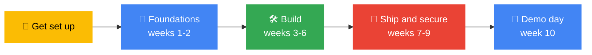

<div align="center">

# ☁️ Cloud Track | GDG on Campus TUM

### Learn it. Build it. Deploy it. Secure it.


[🚀 Getting Started](GETTING-STARTED.md) · [📅 Weekly Sessions](weekly-sessions/README.md) · [🧭 Learning Path](learning-path/README.md) · [📚 Resources](resources/README.md) · [❓ FAQ](FAQ.md)

</div>

---

The Cloud Track is for students who want to understand how modern software is built, deployed and run on the cloud. We start from zero, learn by doing, and finish the semester with something real running in the cloud.

**No experience is needed.** If you can use a laptop and you are curious, you belong here.

> [!TIP]
> **Lost in this repo?** Click the **☰ outline button** at the top right of this page for a clickable table of contents. Every other page in the repo has a **← Back to Cloud Track home** link at the top.

---

## 🧭 Start here: how to use this repo

### If you are new, follow these 5 steps

| Step | Do this | Where |
|:-:|---|---|
| **1** | Read this page (5 minutes) so you know what the track is | You are here |
| **2** | Complete the setup checklist: accounts, tools, 2FA | [GETTING-STARTED.md](GETTING-STARTED.md) |
| **3** | Make your first contribution by adding your profile | [members/](members/README.md) |
| **4** | Open [Week 1](weekly-sessions/week-01-cloud-fundamentals/README.md) and come to the session | [weekly-sessions/](weekly-sessions/README.md) |
| **5** | Share your plan with the chapter | [member-roadmaps](https://github.com/GDG-TUM/member-roadmaps) |

### Or jump straight to what you need

| I want to... | Go here |
|--------------|---------|
| **Set up my laptop and accounts** | [Getting Started](GETTING-STARTED.md) |
| **See what happens each week** | [Weekly Sessions](weekly-sessions/README.md) |
| **Follow the full learning path** | [Learning Path](learning-path/README.md) |
| **See the semester plan and dates** | [Semester Roadmap](roadmap/semester-roadmap.md) |
| **Find free resources and cheat sheets** | [Resources](resources/README.md) |
| **Look up a cloud term** | [Glossary](resources/glossary.md) |
| **Prepare for the Google Kenya hackathon** | [Hackathon Prep](hackathon-prep/README.md) |
| **Start or join a capstone project** | [Projects](projects/README.md) |
| **Get ideas for a project** | [Project Ideas](projects/ideas.md) |
| **Check my project's security** | [Cloud Security Checklist](resources/cloud-security-checklist.md) |
| **Prepare for a certification** | [Certifications](resources/certifications.md) |
| **Ask a question** | [Open a question issue](https://github.com/GDG-TUM/cloud-track/issues/new/choose) |
| **Get answers to common questions** | [FAQ](FAQ.md) |

### Your journey through the track



### Jump around this page

[🎯 Goals](#goals) · [🧭 Learning path](#learning-path) · [🗓️ Roadmap](#roadmap) · [🛠️ Typical week](#typical-week) · [🚀 Capstones](#capstones) · [👥 Roles](#roles) · [✅ Get involved](#involved) · [📚 Resources](#resources) · [📈 Success](#success) · [🤝 Lead commitments](#commitments) · [⚠️ Good to know](#good-to-know) · [📬 Contact](#contact)

---

<a id="goals"></a>
## 🎯 Track goals for the 2026/27 academic year

By the end of the semester, every active member should be able to:

1. Explain core cloud concepts (compute, storage, networking, identity, cost)
2. Use the command line and Git comfortably
3. Containerize an application with Docker
4. Deploy an app to Google Cloud
5. Automate builds and deploys with CI/CD
6. Describe and apply basic cloud security practices (least privilege, secrets handling, logging)
7. Have at least one **public project** on GitHub to show employers

---

<a id="learning-path"></a>
## 🧭 Learning path

Six stages, each with its own page of topics, hands-on tasks and a checkpoint. [See the full learning path →](learning-path/README.md)

| Stage | Topics | Outcome | Read |
|-------|--------|---------|------|
| **1. Foundations** | Cloud concepts, Google Cloud account setup, budgets and billing alerts, IAM basics | A safe, cost-controlled cloud account | [Stage 1](learning-path/01-foundations.md) |
| **2. Tools** | Linux, CLI, Git and GitHub, Docker | A containerized app on your machine | [Stage 2](learning-path/02-tools.md) |
| **3. Build and deploy** | Compute (Cloud Run, Compute Engine), storage, databases, networking basics | An app live on the internet | [Stage 3](learning-path/03-build-and-deploy.md) |
| **4. Ship like a team** | CI/CD with GitHub Actions, Infrastructure as Code with Terraform | Automated deploys from a repo | [Stage 4](learning-path/04-cicd-and-iac.md) |
| **5. Secure and observe** | IAM least privilege, secrets, logging, monitoring | A project you can explain and defend | [Stage 5](learning-path/05-security-and-observability.md) |
| **6. AI on the cloud** | Agents and generative AI on Google Cloud | An AI-powered prototype | [Stage 6](learning-path/06-ai-on-cloud.md) |

---

<a id="roadmap"></a>
## 🗓️ Semester roadmap (draft: October to December 2026)

Click a week to open its agenda, take-home challenge and notes. [Full roadmap →](roadmap/semester-roadmap.md)

| Week | Dates | Focus | What we do |
|------|-------|-------|-----------|
| Kickoff | Mon 5 Oct | Core team onboarding | Track plan agreed, repos and board set up |
| **[1](weekly-sessions/week-01-cloud-fundamentals/README.md)** | 12 Oct | Cloud fundamentals | Intro session, create a safe Google Cloud account, set budget alerts, IAM basics |
| **[2](weekly-sessions/week-02-tools-of-the-trade/README.md)** | 19 Oct | Tools of the trade | Linux, CLI, Git/GitHub, Docker basics; everyone makes their first commit |
| **[3](weekly-sessions/week-03-compute-and-containers/README.md)** | 26 Oct | Compute and containers | Deploy a container to Cloud Run |
| **[4](weekly-sessions/week-04-agentic-ai-study-jam/README.md)** | 2 Nov | Agentic AI study jam | Hackathon prep: guided labs on agents and agentic AI on Google Cloud |
| **[5](weekly-sessions/week-05-hackathon-week/README.md)** | 9 Nov | Hackathon week | Form teams and enter the Google Kenya hackathon (13 Nov) |
| **[6](weekly-sessions/week-06-debrief-and-data/README.md)** | 16 Nov | Debrief and data | Share hackathon lessons; storage, databases, networking basics; capstone teams form |
| **[7](weekly-sessions/week-07-cicd-github-actions/README.md)** | 23 Nov | CI/CD | Automate build, test and deploy with GitHub Actions |
| **[8](weekly-sessions/week-08-infrastructure-as-code/README.md)** | 30 Nov | Infrastructure as Code | Provision cloud resources with Terraform |
| **[9](weekly-sessions/week-09-security-and-monitoring/README.md)** | 7 Dec | Security and monitoring | Least privilege, secrets, logs and alerts; review each other's projects |
| **[10](weekly-sessions/week-10-demo-day/README.md)** | 14 Dec | Demo day | Capstone presentations, retrospective, plan for next semester |

> [!NOTE]
> Dates are a starting plan. We will adjust around exams and campus events and post changes in the track channel.

Hackathon details: [Hackathon Prep](hackathon-prep/README.md)

---

<a id="typical-week"></a>
## 🛠️ How a typical week works

- **One session per week** (hands-on, around 90 minutes: short explanation, then build together)
- **Take-home challenge**, small enough to finish in 1 to 2 hours
- **Notes and code pushed to this repo** after each session
- **Help channel** for questions. No question is too basic.

**Missed a session?** Open that week's folder in [weekly-sessions/](weekly-sessions/README.md), read the README, finish the challenge and ask in the track channel.

---

<a id="capstones"></a>
## 🚀 Capstone projects

From week 6, members work in small teams (3 to 4 people) on a project that is deployed and documented. Ideas:

- A web app deployed on Cloud Run with a database
- A campus tool that solves a real student problem
- An AI assistant or agent built on Google Cloud
- A CI/CD pipeline and infrastructure setup for an existing student project
- A security review of a deployed app, with fixes

Each project needs: a public repo, a README, a live demo or a recording, and a short write-up of what the team learned.

| | |
|---|---|
| 📖 [Capstone guide](projects/README.md) | What every project needs and how to start |
| 💡 [Project ideas](projects/ideas.md) | Beginner, intermediate, AI and security ideas |
| 📝 [README template](projects/project-template.md) | Copy this into your project |
| 🌟 [Showcase](projects/showcase.md) | Finished projects from members |
| 🚀 [Propose a capstone](https://github.com/GDG-TUM/cloud-track/issues/new/choose) | Open a *Capstone proposal* issue |

---

<a id="roles"></a>
## 👥 Roles in the track

| Role | Responsibility |
|------|---------------|
| **Track Lead** | Plans the semester, runs sessions, maintains this repo, supports teams |
| **Members** | Attend, complete challenges, build a capstone, help each other |
| **Mentors (invited)** | Industry or senior-student guests for talks and reviews |

---

<a id="involved"></a>
## ✅ How to get involved

1. Make sure you have joined the [**GDG-TUM** GitHub organization](https://github.com/GDG-TUM)
2. Add your personal plan in the [**member-roadmaps**](https://github.com/GDG-TUM/member-roadmaps) repo (open a *Member Roadmap* issue)
3. Make your first contribution by [adding your profile](members/README.md)
4. Come to the next session. Dates will be posted in the track channel and the [org Projects board](https://github.com/orgs/GDG-TUM/projects).
5. Read our [CONTRIBUTING guide](https://github.com/GDG-TUM/.github/blob/main/CONTRIBUTING.md) before your first pull request

**New to GitHub?** That is fine. [Week 2](weekly-sessions/week-02-tools-of-the-trade/README.md) teaches the whole flow, and the [Git cheat sheet](resources/cheatsheets/git.md) is there while you learn.

---

<a id="resources"></a>
## 📚 Free resources to start with

- [Google Cloud Skills Boost](https://www.skills.google/) (free labs and learning paths)
- [Google Cloud documentation and quickstarts](https://docs.cloud.google.com/docs)
- [GitHub Skills](https://github.com/SKILLS) (interactive Git and GitHub courses)
- [Docker's official getting-started guide](https://docs.docker.com/get-started/)
- [Terraform tutorials on HashiCorp Developer](https://developer.hashicorp.com/terraform/tutorials)

**More inside this repo:**
[All resources](resources/README.md) · [Glossary](resources/glossary.md) · [Certifications](resources/certifications.md) · [Security checklist](resources/cloud-security-checklist.md)

**Cheat sheets:** [Git](resources/cheatsheets/git.md) · [Docker](resources/cheatsheets/docker.md) · [gcloud](resources/cheatsheets/gcloud.md) · [Linux](resources/cheatsheets/linux.md) · [Terraform](resources/cheatsheets/terraform.md)

---

<a id="success"></a>
## 📈 How we will know the track is working

- Number of members who deploy at least one project
- Number of public repos and merged pull requests from members
- Session attendance and member feedback after each phase
- Projects shown at demo day
- Members who go on to hackathons, internships or certifications

Tell us how we are doing: [give session feedback](https://github.com/GDG-TUM/cloud-track/issues/new/choose).

---

<a id="commitments"></a>
## 🤝 Track lead commitments

I commit to:

- Running one session every week of the semester and posting the notes here
- Keeping the roadmap, board and repo up to date
- Giving feedback on every capstone team's work
- Holding a short monthly check-in so nobody falls behind quietly
- Sharing what I learn along the way, including mistakes

*Suggestions are welcome. [Open an issue](https://github.com/GDG-TUM/cloud-track/issues/new/choose) or talk to me directly.*

---

<a id="good-to-know"></a>
## ⚠️ Good to know

> [!WARNING]
> **Cloud services can cost money if left running.** Set a **budget alert** in Week 1 and **delete resources** when an exercise ends. Check each provider's current free-tier and trial terms before creating anything.

- **Never commit secrets.** No passwords, API keys, tokens or `.env` files in any repo. If it happens, tell a maintainer immediately. See the [security policy](https://github.com/GDG-TUM/.github/blob/main/SECURITY.md).
- **Be kind.** We follow the [Code of Conduct](https://github.com/GDG-TUM/.github/blob/main/CODE_OF_CONDUCT.md).
- **Old or slow laptop?** Use **Cloud Shell** (a free browser terminal in Google Cloud). Details in the [FAQ](FAQ.md).
- **Why Google Cloud?** We are a Google Developer Group chapter. The ideas transfer directly to AWS and Azure.
- **Cannot attend a session?** Everything is in this repo. Work through the week's folder at your own pace.

---

## 🗂️ Repo map

```
cloud-track/
├── README.md                  ← you are here
├── GETTING-STARTED.md         ← setup checklist
├── FAQ.md                     ← common questions
├── roadmap/                   ← semester plan and dates
├── learning-path/             ← 6 stages from foundations to AI
├── weekly-sessions/           ← one folder per week (agenda, challenge, notes)
├── hackathon-prep/            ← Google Kenya hackathon preparation
├── projects/                  ← capstone guide, ideas, template, showcase
├── resources/                 ← free resources, glossary, cheat sheets, checklists
├── members/                   ← add your profile (your first pull request)
└── .github/ISSUE_TEMPLATE/    ← ask a question, give feedback, propose a project
```

**Folder links:** [roadmap](roadmap/semester-roadmap.md) · [learning-path](learning-path/README.md) · [weekly-sessions](weekly-sessions/README.md) · [hackathon-prep](hackathon-prep/README.md) · [projects](projects/README.md) · [resources](resources/README.md) · [members](members/README.md)

---

<a id="contact"></a>
## 📬 Contact

| | |
|---|---|
| 🏠 **GitHub organization** | [github.com/GDG-TUM](https://github.com/GDG-TUM) |
| 📋 **Chapter project board** | [GDG-TUM Projects](https://github.com/orgs/GDG-TUM/projects) |
| 💼 **LinkedIn** | [GDG on Campus TUM](https://www.linkedin.com/company/gdg-on-campus-tum/) |
| ✉️ **Email** | [gdgtum@gmail.com](mailto:gdgtum@gmail.com) |
| 💬 **Questions about this track** | [Open an issue](https://github.com/GDG-TUM/cloud-track/issues/new/choose) |

📄 Licensed under the [MIT License](LICENSE).

<div align="center">

[⬆️ Back to top](#)

*Learn. Build. Deploy. Together.* ☁️

</div>
