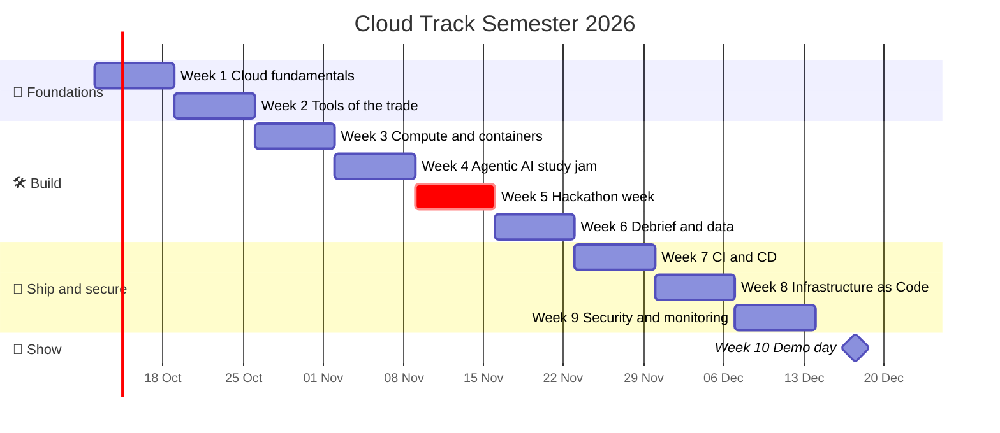
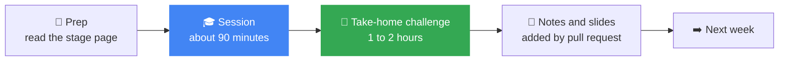

[← Back to Cloud Track home](../README.md)

<div align="center">

# 📅 Weekly Sessions

**10 weeks · 1 session a week · 1 thing working at the end of each**


[🚀 Start with Week 1](week-01-cloud-fundamentals/README.md) · [🧭 Learning path](../learning-path/README.md) · [🏆 Hackathon prep](../hackathon-prep/README.md) · [📚 Resources](../resources/README.md)

</div>

---

> [!NOTE]
> Every week folder has the same layout: **goal → objectives → prep → agenda → hands-on commands → take-home challenge → notes and slides**. Once you know one week, you know them all.

## 🗺️ The semester at a glance



> [!TIP]
> Red = the **Google Kenya hackathon (13 Nov)**. Dates are a draft and may shift around exams. Changes are announced in the track channel.

---

## 🌱 Phase 1: Foundations

| | Week | Date | Session | You will... | Status |
|:-:|:-:|:-:|---|---|:-:|
| ☁️ | **1** | 12 Oct | **[Cloud fundamentals](week-01-cloud-fundamentals/README.md)** | Understand the cloud and set up a safe, cost-controlled account | 🟡 Upcoming |
| 🧰 | **2** | 19 Oct | **[Tools of the trade](week-02-tools-of-the-trade/README.md)** | Get comfortable with Linux, Git and Docker, and make your first pull request | 🟡 Upcoming |

## 🛠️ Phase 2: Build

| | Week | Date | Session | You will... | Status |
|:-:|:-:|:-:|---|---|:-:|
| 🐳 | **3** | 26 Oct | **[Compute and containers](week-03-compute-and-containers/README.md)** | Put a container on the internet with Cloud Run | 🟡 Upcoming |
| 🤖 | **4** | 2 Nov | **[Agentic AI study jam](week-04-agentic-ai-study-jam/README.md)** | Learn the basics of AI agents and prepare for the hackathon | 🟡 Upcoming |
| 🏆 | **5** | 9 Nov | **[Hackathon week](week-05-hackathon-week/README.md)** | Form teams and enter the Google Kenya hackathon on 13 Nov | 🟡 Upcoming |
| 🗄️ | **6** | 16 Nov | **[Debrief and data](week-06-debrief-and-data/README.md)** | Share lessons, then cover storage, databases and networking | 🟡 Upcoming |

## 🚢 Phase 3: Ship and secure

| | Week | Date | Session | You will... | Status |
|:-:|:-:|:-:|---|---|:-:|
| ⚙️ | **7** | 23 Nov | **[CI/CD with GitHub Actions](week-07-cicd-github-actions/README.md)** | Automate build, test and deploy | 🟡 Upcoming |
| 🏗️ | **8** | 30 Nov | **[Infrastructure as Code](week-08-infrastructure-as-code/README.md)** | Define cloud resources in code with Terraform | 🟡 Upcoming |
| 🔐 | **9** | 7 Dec | **[Security and monitoring](week-09-security-and-monitoring/README.md)** | Harden your project and make it observable | 🟡 Upcoming |

## 🎤 Phase 4: Show

| | Week | Date | Session | You will... | Status |
|:-:|:-:|:-:|---|---|:-:|
| 🌟 | **10** | 14 Dec | **[Demo day](week-10-demo-day/README.md)** | Show what you built, reflect, and plan the next semester | 🟡 Upcoming |

**Status key:** 🟡 Upcoming · 🟢 Done · 🔵 Happening now · ⚪ Rescheduled

---

## 🔄 How every week works



<table>
<tr>
<td width="50%" valign="top">

### 🙋 Missed a session?
No problem.

1. Open that week's folder
2. Read the README
3. Finish the challenge
4. Ask in the track channel

Everything you need is in the repo.

</td>
<td width="50%" valign="top">

### ✍️ Adding session notes
After each session, the Track Lead (or anyone who took notes) can add slides, links and takeaways to that week's README with a pull request.

See the [contributing guide](https://github.com/GDG-TUM/.github/blob/main/CONTRIBUTING.md).

</td>
</tr>
</table>

---

## ✅ Your progress tracker

Copy this into your [Member Roadmap](https://github.com/GDG-TUM/member-roadmaps) issue and tick as you go:

```markdown
- [ ] Week 1: Cloud fundamentals
- [ ] Week 2: Tools of the trade (first PR merged)
- [ ] Week 3: Compute and containers (app deployed, then deleted)
- [ ] Week 4: Agentic AI study jam
- [ ] Week 5: Hackathon week
- [ ] Week 6: Debrief and data (capstone team formed)
- [ ] Week 7: CI/CD (pipeline on my capstone)
- [ ] Week 8: Infrastructure as Code
- [ ] Week 9: Security and monitoring
- [ ] Week 10: Demo day
```

---

<details>
<summary><b>🧩 Running a new session? Use the template</b></summary>

<br/>

Copy [`_template/README.md`](_template/README.md) into a new folder named `week-NN-short-title/` and fill it in.

Keep each session to one idea, one demo, and one challenge small enough to finish in 1 to 2 hours.

</details>

<div align="center">

*Learn. Build. Deploy. Together.* ☁️

</div>
